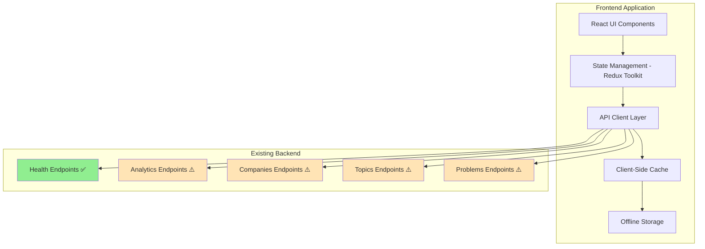
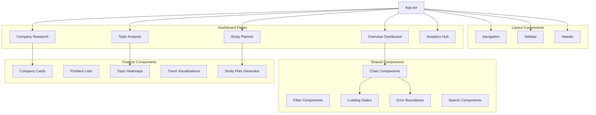

# Design Document

## Overview

The Interview Preparation Dashboard is a comprehensive frontend application that leverages the existing LeetCode Analytics API to provide powerful, data-driven interview preparation tools. The system will feature interactive dashboards for company research, topic trend analysis, smart study plan generation, and analytics insights, utilizing 18,668 real problem records from 470+ companies.

The design prioritizes performance optimization, graceful error handling, and progressive enhancement to work effectively with the existing API's characteristics (30+ second cold starts, potential 500 errors, no backend pagination).

## Architecture

### High-Level Architecture



### Technology Stack

**Frontend Framework**: React 18 with TypeScript
- **Rationale**: Mature ecosystem, excellent TypeScript support, component reusability
- **State Management**: Redux Toolkit with RTK Query for API caching
- **Routing**: React Router v6 for SPA navigation

**UI Framework**: Material-UI (MUI) v5
- **Rationale**: Comprehensive component library, built-in theming, responsive design
- **Charts**: Recharts for data visualizations
- **Icons**: Material Icons and Heroicons

**Data Management**:
- **API Client**: RTK Query with custom retry logic
- **Caching**: Browser localStorage + IndexedDB for large datasets
- **Offline Support**: Service Worker for critical functionality

**Build Tools**:
- **Bundler**: Vite for fast development and optimized builds
- **Testing**: Vitest + React Testing Library
- **Linting**: ESLint + Prettier

## Components and Interfaces

### Core Component Architecture



### API Integration Layer

```typescript
// API Client Configuration
interface ApiConfig {
  baseURL: string;
  timeout: number;
  retryAttempts: number;
  retryDelay: number;
}

// API Response Types
interface ApiResponse<T> {
  data: T;
  status: 'success' | 'error';
  message?: string;
  correlation_id?: string;
}

// Pagination Support (Client-Side)
interface PaginatedData<T> {
  items: T[];
  total: number;
  page: number;
  pageSize: number;
  hasNext: boolean;
  hasPrevious: boolean;
}

// Error Handling
interface ApiError {
  code: string;
  message: string;
  details?: string;
  correlation_id?: string;
}
```

### State Management Schema

```typescript
interface RootState {
  // API Status
  api: {
    health: 'healthy' | 'degraded' | 'unhealthy';
    lastHealthCheck: string;
    endpointStatus: Record<string, 'working' | 'slow' | 'error'>;
  };
  
  // User Preferences
  user: {
    targetCompanies: string[];
    skillLevel: 'beginner' | 'intermediate' | 'advanced';
    studyGoals: StudyGoal[];
    preferences: UserPreferences;
  };
  
  // Cached Data
  cache: {
    companies: CompanyData[];
    problems: ProblemData[];
    topics: TopicData[];
    analytics: AnalyticsData;
    lastUpdated: Record<string, string>;
  };
  
  // UI State
  ui: {
    activeFilters: FilterState;
    selectedCompanies: string[];
    currentView: 'overview' | 'company' | 'topics' | 'study' | 'analytics';
    loadingStates: Record<string, boolean>;
    errors: Record<string, ApiError | null>;
  };
}
```

## Data Models

### Core Data Models

```typescript
// Company Data Model
interface CompanyData {
  company: string;
  totalProblems: number;
  uniqueProblems: number;
  avgFrequency: number;
  avgAcceptanceRate: number;
  difficultyDistribution: {
    EASY: number;
    MEDIUM: number;
    HARD: number;
    UNKNOWN: number;
  };
  topTopics: string[];
  timeframeCoverage: string[];
  rank?: number;
}

// Problem Data Model
interface ProblemData {
  title: string;
  difficulty: 'EASY' | 'MEDIUM' | 'HARD' | 'UNKNOWN';
  frequency: number;
  acceptanceRate: number;
  link: string;
  topics: string[];
  company: string;
  timeframe: string;
  totalFrequency?: number;
  companyCount?: number;
}

// Topic Data Model
interface TopicData {
  topic: string;
  frequency: number;
  trendDirection: 'increasing' | 'decreasing' | 'stable';
  trendStrength: number;
  timeframeFrequencies: Record<string, number>;
  companies: string[];
}

// Analytics Data Model
interface AnalyticsData {
  correlations: CorrelationData[];
  difficultyAnalysis: DifficultyAnalysis;
  trends: TrendAnalysis;
  insights: InsightData[];
  summary: AnalyticsSummary;
}

// Study Plan Model
interface StudyPlan {
  id: string;
  name: string;
  targetCompanies: string[];
  duration: number; // weeks
  dailyGoal: number; // problems per day
  focusAreas: string[];
  schedule: StudySession[];
  progress: StudyProgress;
}
```

### Filter and Search Models

```typescript
interface FilterCriteria {
  companies?: string[];
  difficulties?: ('EASY' | 'MEDIUM' | 'HARD')[];
  topics?: string[];
  timeframes?: string[];
  frequencyRange?: [number, number];
  acceptanceRateRange?: [number, number];
}

interface SearchCriteria extends FilterCriteria {
  query?: string;
  sortBy?: string;
  sortOrder?: 'asc' | 'desc';
  limit?: number;
}
```

## Error Handling

### Error Handling Strategy

```typescript
// Error Boundary Component
class ApiErrorBoundary extends React.Component {
  state = { hasError: false, error: null };
  
  static getDerivedStateFromError(error: Error) {
    return { hasError: true, error };
  }
  
  componentDidCatch(error: Error, errorInfo: React.ErrorInfo) {
    // Log error to monitoring service
    console.error('API Error:', error, errorInfo);
  }
  
  render() {
    if (this.state.hasError) {
      return <ErrorFallback error={this.state.error} />;
    }
    return this.props.children;
  }
}

// API Error Handler
const handleApiError = (error: ApiError, endpoint: string) => {
  const errorStrategies = {
    // 500 errors - show cached data if available
    'INTERNAL_SERVER_ERROR': () => showCachedDataFallback(endpoint),
    
    // Timeout errors - show loading state with retry option
    'TIMEOUT_ERROR': () => showRetryOption(endpoint),
    
    // Network errors - show offline mode
    'NETWORK_ERROR': () => enableOfflineMode(),
    
    // Validation errors - show user-friendly message
    'VALIDATION_ERROR': (error: ApiError) => showValidationMessage(error.details)
  };
  
  const strategy = errorStrategies[error.code] || showGenericError;
  return strategy(error);
};
```

### Graceful Degradation

```typescript
// Progressive Enhancement Strategy
const FeatureAvailability = {
  // Always available (using health endpoints)
  CORE: ['health-check', 'basic-stats', 'cached-data'],
  
  // Available when analytics endpoints work
  ENHANCED: ['correlations', 'basic-trends', 'simple-insights'],
  
  // Available when all endpoints are stable
  ADVANCED: ['complex-analytics', 'real-time-updates', 'advanced-filtering']
};

// Feature Flag System
const useFeatureFlag = (feature: string) => {
  const { endpointStatus } = useSelector(state => state.api);
  
  return useMemo(() => {
    switch (feature) {
      case 'company-comparison':
        return endpointStatus.companies === 'working';
      case 'topic-heatmap':
        return endpointStatus.topics === 'working';
      case 'advanced-analytics':
        return endpointStatus.analytics === 'working';
      default:
        return true; // Core features always available
    }
  }, [endpointStatus, feature]);
};
```

## Performance Optimization

### Caching Strategy

```typescript
// Multi-Level Caching
interface CacheStrategy {
  // Level 1: Redux Store (in-memory)
  memory: {
    duration: number; // 5 minutes
    maxSize: number;  // 100MB
  };
  
  // Level 2: localStorage (persistent)
  localStorage: {
    duration: number; // 1 hour
    maxSize: number;  // 50MB
  };
  
  // Level 3: IndexedDB (large datasets)
  indexedDB: {
    duration: number; // 24 hours
    maxSize: number;  // 500MB
  };
}

// Smart Cache Invalidation
const useCacheInvalidation = () => {
  const invalidateCache = useCallback((keys: string[]) => {
    keys.forEach(key => {
      // Clear from all cache levels
      store.dispatch(clearCacheKey(key));
      localStorage.removeItem(`cache_${key}`);
      indexedDB.deleteItem(key);
    });
  }, []);
  
  return { invalidateCache };
};
```

### Loading Optimization

```typescript
// Progressive Loading Component
const ProgressiveLoader: React.FC<{
  endpoint: string;
  fallbackData?: any;
  timeout?: number;
}> = ({ endpoint, fallbackData, timeout = 30000 }) => {
  const [phase, setPhase] = useState<'loading' | 'slow' | 'timeout' | 'error'>('loading');
  
  useEffect(() => {
    const slowTimer = setTimeout(() => setPhase('slow'), 5000);
    const timeoutTimer = setTimeout(() => setPhase('timeout'), timeout);
    
    return () => {
      clearTimeout(slowTimer);
      clearTimeout(timeoutTimer);
    };
  }, [timeout]);
  
  return (
    <div className="progressive-loader">
      {phase === 'loading' && <Spinner />}
      {phase === 'slow' && <SlowLoadingMessage />}
      {phase === 'timeout' && <TimeoutFallback data={fallbackData} />}
    </div>
  );
};
```

### Virtual Scrolling for Large Datasets

```typescript
// Virtual List Component for Problem Lists
const VirtualProblemList: React.FC<{
  problems: ProblemData[];
  itemHeight: number;
  containerHeight: number;
}> = ({ problems, itemHeight, containerHeight }) => {
  const [scrollTop, setScrollTop] = useState(0);
  
  const visibleStart = Math.floor(scrollTop / itemHeight);
  const visibleEnd = Math.min(
    visibleStart + Math.ceil(containerHeight / itemHeight) + 1,
    problems.length
  );
  
  const visibleItems = problems.slice(visibleStart, visibleEnd);
  
  return (
    <div 
      className="virtual-list"
      style={{ height: containerHeight, overflow: 'auto' }}
      onScroll={(e) => setScrollTop(e.currentTarget.scrollTop)}
    >
      <div style={{ height: problems.length * itemHeight, position: 'relative' }}>
        {visibleItems.map((problem, index) => (
          <ProblemCard
            key={problem.title}
            problem={problem}
            style={{
              position: 'absolute',
              top: (visibleStart + index) * itemHeight,
              height: itemHeight
            }}
          />
        ))}
      </div>
    </div>
  );
};
```

## Testing Strategy

### Testing Pyramid

```typescript
// Unit Tests - Component Logic
describe('CompanyCard', () => {
  it('should display company statistics correctly', () => {
    const mockCompany: CompanyData = {
      company: 'Google',
      totalProblems: 150,
      uniqueProblems: 120,
      avgFrequency: 2.5,
      avgAcceptanceRate: 0.65,
      difficultyDistribution: { EASY: 30, MEDIUM: 70, HARD: 50, UNKNOWN: 0 },
      topTopics: ['Arrays', 'Dynamic Programming'],
      timeframeCoverage: ['30d', '3m']
    };
    
    render(<CompanyCard company={mockCompany} />);
    
    expect(screen.getByText('Google')).toBeInTheDocument();
    expect(screen.getByText('150 problems')).toBeInTheDocument();
  });
});

// Integration Tests - API Integration
describe('API Integration', () => {
  it('should handle slow API responses gracefully', async () => {
    // Mock slow API response
    server.use(
      rest.get('/api/v1/companies/stats', (req, res, ctx) => {
        return res(ctx.delay(35000), ctx.json(mockCompanyStats));
      })
    );
    
    render(<CompanyDashboard />);
    
    // Should show loading state
    expect(screen.getByText(/loading/i)).toBeInTheDocument();
    
    // Should show slow loading message after 5 seconds
    await waitFor(() => {
      expect(screen.getByText(/taking longer than expected/i)).toBeInTheDocument();
    }, { timeout: 6000 });
  });
});

// E2E Tests - User Workflows
describe('Study Plan Creation', () => {
  it('should create a study plan for FAANG companies', () => {
    cy.visit('/study-planner');
    
    // Select target companies
    cy.get('[data-testid="company-selector"]').click();
    cy.get('[data-testid="company-Google"]').click();
    cy.get('[data-testid="company-Amazon"]').click();
    
    // Set study parameters
    cy.get('[data-testid="duration-input"]').type('8');
    cy.get('[data-testid="daily-goal-input"]').type('3');
    
    // Generate plan
    cy.get('[data-testid="generate-plan"]').click();
    
    // Verify plan creation
    cy.get('[data-testid="study-plan"]').should('be.visible');
    cy.get('[data-testid="plan-problems"]').should('contain', 'problems');
  });
});
```

### Mock Data Strategy

```typescript
// Mock API Responses for Development
const mockApiResponses = {
  '/api/v1/health/quick': {
    status: 'healthy',
    timestamp: new Date().toISOString()
  },
  
  '/api/v1/companies/stats': {
    data: [
      {
        company: 'Google',
        totalProblems: 150,
        uniqueProblems: 120,
        avgFrequency: 2.5,
        // ... more mock data
      }
    ],
    total: 470
  },
  
  '/api/v1/problems/top': {
    data: [
      {
        title: 'Two Sum',
        difficulty: 'EASY',
        frequency: 4.2,
        acceptanceRate: 0.49,
        // ... more mock data
      }
    ]
  }
};

// Development Mode API Interceptor
if (process.env.NODE_ENV === 'development') {
  // Use MSW (Mock Service Worker) for API mocking
  worker.start({
    onUnhandledRequest: 'bypass'
  });
}
```

## Security Considerations

### Client-Side Security

```typescript
// Input Sanitization
const sanitizeInput = (input: string): string => {
  return DOMPurify.sanitize(input, {
    ALLOWED_TAGS: [],
    ALLOWED_ATTR: []
  });
};

// XSS Prevention
const SafeHTML: React.FC<{ content: string }> = ({ content }) => {
  const sanitizedContent = useMemo(() => 
    DOMPurify.sanitize(content), [content]
  );
  
  return <div dangerouslySetInnerHTML={{ __html: sanitizedContent }} />;
};

// API Security Headers
const apiClient = axios.create({
  baseURL: process.env.REACT_APP_API_BASE_URL,
  headers: {
    'Content-Type': 'application/json',
    'X-Requested-With': 'XMLHttpRequest'
  },
  withCredentials: false // No cookies needed for this API
});
```

### Data Privacy

```typescript
// Local Storage Encryption (for sensitive user data)
const encryptedStorage = {
  setItem: (key: string, value: any) => {
    const encrypted = CryptoJS.AES.encrypt(
      JSON.stringify(value), 
      process.env.REACT_APP_ENCRYPTION_KEY
    ).toString();
    localStorage.setItem(key, encrypted);
  },
  
  getItem: (key: string) => {
    const encrypted = localStorage.getItem(key);
    if (!encrypted) return null;
    
    const decrypted = CryptoJS.AES.decrypt(
      encrypted, 
      process.env.REACT_APP_ENCRYPTION_KEY
    ).toString(CryptoJS.enc.Utf8);
    
    return JSON.parse(decrypted);
  }
};
```

## Deployment Strategy

### Build Configuration

```typescript
// Vite Configuration
export default defineConfig({
  plugins: [react()],
  build: {
    target: 'es2015',
    outDir: 'dist',
    sourcemap: true,
    rollupOptions: {
      output: {
        manualChunks: {
          vendor: ['react', 'react-dom'],
          ui: ['@mui/material', '@mui/icons-material'],
          charts: ['recharts', 'd3'],
          utils: ['lodash', 'date-fns']
        }
      }
    }
  },
  server: {
    proxy: {
      '/api': {
        target: 'http://localhost:8000',
        changeOrigin: true
      }
    }
  }
});
```

### Environment Configuration

```typescript
// Environment Variables
interface EnvironmentConfig {
  REACT_APP_API_BASE_URL: string;
  REACT_APP_ENVIRONMENT: 'development' | 'staging' | 'production';
  REACT_APP_ENABLE_MOCK_API: boolean;
  REACT_APP_CACHE_DURATION: number;
  REACT_APP_MAX_RETRY_ATTEMPTS: number;
  REACT_APP_ANALYTICS_ENABLED: boolean;
}

// Configuration Management
const config: EnvironmentConfig = {
  REACT_APP_API_BASE_URL: process.env.REACT_APP_API_BASE_URL || 'http://localhost:8000',
  REACT_APP_ENVIRONMENT: process.env.REACT_APP_ENVIRONMENT as any || 'development',
  REACT_APP_ENABLE_MOCK_API: process.env.REACT_APP_ENABLE_MOCK_API === 'true',
  REACT_APP_CACHE_DURATION: parseInt(process.env.REACT_APP_CACHE_DURATION || '3600000'),
  REACT_APP_MAX_RETRY_ATTEMPTS: parseInt(process.env.REACT_APP_MAX_RETRY_ATTEMPTS || '3'),
  REACT_APP_ANALYTICS_ENABLED: process.env.REACT_APP_ANALYTICS_ENABLED === 'true'
};
```

This design provides a robust, scalable frontend architecture that effectively leverages your existing API while handling its current limitations through smart caching, error handling, and progressive enhancement strategies.