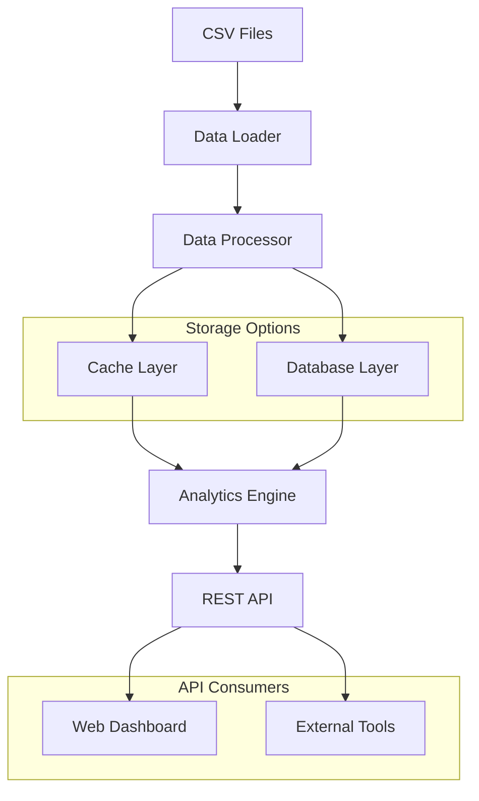

# Design Document

## Overview

The LeetCode Analytics API system will be built as a Python-based data processing and REST API service that transforms raw CSV data from 470+ company directories into a unified analytics platform. The system follows a hybrid architecture combining in-memory pandas processing for flexibility with optional database persistence for scalability and performance.

The core design philosophy emphasizes:
- **Data Integrity**: Robust CSV parsing and validation with error handling
- **Performance**: Efficient caching and vectorized operations using pandas
- **Scalability**: Optional database backend with proper indexing
- **Flexibility**: Rich filtering and aggregation capabilities via REST API
- **Maintainability**: Clean separation of concerns and comprehensive logging

## Architecture

### High-Level Architecture



### Component Architecture

The system consists of five main layers:

1. **Data Ingestion Layer**: Handles CSV discovery, loading, and initial validation
2. **Processing Layer**: Normalizes data, adds metadata, and handles topic explosion
3. **Storage Layer**: Manages both cache (Parquet) and optional database persistence
4. **Analytics Layer**: Provides aggregation, filtering, and analytical operations
5. **API Layer**: Exposes REST endpoints with proper error handling and pagination

## Components and Interfaces

### 1. Data Loader Component

**Purpose**: Discovers and loads CSV files from company directories

**Key Classes**:
- `CSVDiscovery`: Scans directory structure and identifies valid CSV files
- `CSVLoader`: Loads individual CSV files with error handling
- `DataValidator`: Validates CSV structure and data types

**Interface**:
```python
class DataLoader:
    def discover_csv_files(self, root_path: str) -> List[CSVFileInfo]
    def load_csv_batch(self, file_infos: List[CSVFileInfo]) -> pd.DataFrame
    def validate_csv_structure(self, df: pd.DataFrame) -> ValidationResult
```

**Key Features**:
- Parallel CSV loading for performance
- Robust error handling for malformed files
- Progress tracking for large datasets
- Automatic detection of encoding issues

### 2. Data Processor Component

**Purpose**: Normalizes and enriches raw CSV data

**Key Classes**:
- `DataNormalizer`: Standardizes column formats and data types
- `MetadataEnricher`: Adds company and timeframe metadata
- `TopicExploder`: Handles comma-separated topics expansion

**Interface**:
```python
class DataProcessor:
    def normalize_data(self, raw_df: pd.DataFrame) -> pd.DataFrame
    def add_metadata(self, df: pd.DataFrame, file_info: CSVFileInfo) -> pd.DataFrame
    def explode_topics(self, df: pd.DataFrame) -> pd.DataFrame
```

**Normalization Rules**:
- Convert `Frequency` to float64
- Parse `Acceptance Rate` as percentage (0.0-1.0)
- Standardize `Difficulty` values (EASY, MEDIUM, HARD)
- Clean and validate `Link` URLs
- Split `Topics` on commas and strip whitespace

### 3. Storage Manager Component

**Purpose**: Manages data persistence and caching strategies

**Key Classes**:
- `CacheManager`: Handles Parquet file caching with invalidation
- `DatabaseManager`: Optional SQL database operations
- `StorageConfig`: Configuration for storage backends

**Interface**:
```python
class StorageManager:
    def save_to_cache(self, df: pd.DataFrame, cache_key: str) -> bool
    def load_from_cache(self, cache_key: str) -> Optional[pd.DataFrame]
    def is_cache_valid(self, cache_key: str, source_files: List[str]) -> bool
    def save_to_database(self, df: pd.DataFrame, table_name: str) -> bool
```

**Storage Strategy**:
- Primary: Parquet files for fast columnar access
- Secondary: Optional PostgreSQL/SQLite for complex queries
- Cache invalidation based on source file modification times
- Partitioned storage by company for large datasets

### 4. Analytics Engine Component

**Purpose**: Provides core analytical operations and aggregations

**Key Classes**:
- `CrossCompanyAnalyzer`: Aggregates data across companies
- `TrendAnalyzer`: Temporal analysis and trend detection
- `TopicAnalyzer`: Topic clustering and correlation analysis
- `DifficultyAnalyzer`: Difficulty-based statistics and correlations

**Interface**:
```python
class AnalyticsEngine:
    def get_top_problems(self, filters: FilterCriteria) -> pd.DataFrame
    def analyze_topic_trends(self, timeframes: List[str]) -> pd.DataFrame
    def get_company_correlations(self, metric: str) -> pd.DataFrame
    def calculate_difficulty_stats(self, groupby: str) -> pd.DataFrame
```

**Key Analytics Operations**:
- Cross-company problem frequency aggregation
- Temporal trend analysis (30d vs 3m vs 6m)
- Topic co-occurrence and clustering
- Difficulty-acceptance rate correlations
- Company similarity analysis

### 5. REST API Component

**Purpose**: Exposes analytics capabilities via HTTP endpoints

**Key Classes**:
- `APIServer`: FastAPI application with route definitions
- `RequestValidator`: Input validation and sanitization
- `ResponseFormatter`: Consistent JSON response formatting
- `PaginationHandler`: Efficient pagination for large results

**Core Endpoints**:
```
GET /api/v1/problems/top              # Top problems across companies
GET /api/v1/problems/search           # Search problems with filters
GET /api/v1/topics/trends             # Topic trend analysis
GET /api/v1/companies/stats           # Company-specific statistics
GET /api/v1/analytics/correlations    # Cross-metric correlations
GET /api/v1/health                    # System health check
```

## Data Models

### Core Data Schema

**Unified Problem Record**:
```python
@dataclass
class ProblemRecord:
    difficulty: str              # EASY, MEDIUM, HARD
    title: str                  # Problem title
    frequency: float            # Frequency score (0-100)
    acceptance_rate: float      # Acceptance rate (0.0-1.0)
    link: str                   # LeetCode URL
    topics: List[str]           # List of topic tags
    company: str                # Company name
    timeframe: str              # Time window (30d, 3m, 6m, 6m+, all)
    source_file: str            # Original CSV file path
    last_updated: datetime      # Data freshness timestamp
```

**Aggregated Analytics Schema**:
```python
@dataclass
class ProblemStats:
    title: str
    total_frequency: float      # Sum across all companies
    company_count: int          # Number of companies asking this
    avg_acceptance_rate: float  # Average acceptance rate
    difficulty: str
    primary_topics: List[str]   # Most common topics
    trend_score: float          # Trending indicator
```

### Database Schema (Optional)

**Tables**:
1. `problems` - Core problem data with indexes on title, company, difficulty
2. `problem_topics` - Many-to-many relationship for topic analysis
3. `company_stats` - Pre-computed company-level statistics
4. `topic_trends` - Time-series topic popularity data

**Key Indexes**:
- `idx_problems_company_timeframe` for company-specific queries
- `idx_problems_difficulty_frequency` for difficulty analysis
- `idx_problem_topics_topic` for topic-based filtering
- `idx_problems_title` for problem lookup

## Error Handling

### Error Categories and Strategies

**Data Loading Errors**:
- **Malformed CSV**: Log error, skip file, continue processing
- **Missing Columns**: Attempt column mapping, fallback to defaults
- **Encoding Issues**: Try multiple encodings (utf-8, latin-1, cp1252)
- **Empty Files**: Log warning, skip file

**Data Processing Errors**:
- **Invalid Frequency**: Set to 0.0, log warning
- **Malformed URLs**: Keep original, add validation flag
- **Unknown Difficulty**: Map to "UNKNOWN", log for review
- **Topic Parsing**: Handle edge cases in comma separation

**API Errors**:
- **400 Bad Request**: Invalid query parameters with detailed messages
- **404 Not Found**: Resource not found with suggestions
- **429 Too Many Requests**: Rate limiting with retry headers
- **500 Internal Server Error**: Logged errors with correlation IDs

**Error Response Format**:
```json
{
  "error": {
    "code": "INVALID_FILTER",
    "message": "Invalid difficulty filter: 'EXTREME'",
    "details": "Valid values are: EASY, MEDIUM, HARD",
    "correlation_id": "req_123456789"
  }
}
```

## Testing Strategy

### Unit Testing
- **Data Processing**: Test normalization, validation, and topic explosion
- **Analytics Engine**: Verify aggregation logic and edge cases
- **API Endpoints**: Test request/response handling and validation
- **Storage Layer**: Mock database operations and cache behavior

### Integration Testing
- **End-to-End Data Flow**: CSV loading through API response
- **Database Integration**: Test with real database connections
- **Cache Invalidation**: Verify cache refresh on data changes
- **Error Scenarios**: Test system behavior under various failure modes

### Performance Testing
- **Load Testing**: API performance under concurrent requests
- **Data Volume Testing**: Processing large datasets (1M+ records)
- **Memory Usage**: Monitor memory consumption during processing
- **Cache Performance**: Measure cache hit rates and response times

### Test Data Strategy
- **Sample CSV Files**: Representative data from major companies
- **Edge Cases**: Malformed data, missing fields, encoding issues
- **Scale Testing**: Generated datasets of various sizes
- **Mock Services**: Database and external service mocking

## Performance Considerations

### Data Processing Optimizations
- **Vectorized Operations**: Use pandas vectorized functions over loops
- **Chunked Processing**: Process large datasets in manageable chunks
- **Parallel Loading**: Multi-threaded CSV loading for I/O bound operations
- **Memory Management**: Efficient data types and garbage collection

### Caching Strategy
- **Multi-Level Caching**: In-memory + disk-based caching
- **Cache Warming**: Pre-compute common queries on startup
- **Selective Invalidation**: Invalidate only affected cache entries
- **Compression**: Use Parquet compression for disk cache

### API Performance
- **Response Pagination**: Limit result set sizes with cursor-based pagination
- **Query Optimization**: Efficient filtering and aggregation
- **Connection Pooling**: Database connection management
- **Response Compression**: Gzip compression for large responses

### Scalability Considerations
- **Horizontal Scaling**: Stateless API design for load balancing
- **Database Sharding**: Partition by company or timeframe if needed
- **Async Processing**: Background data refresh and analytics computation
- **Resource Monitoring**: CPU, memory, and disk usage tracking